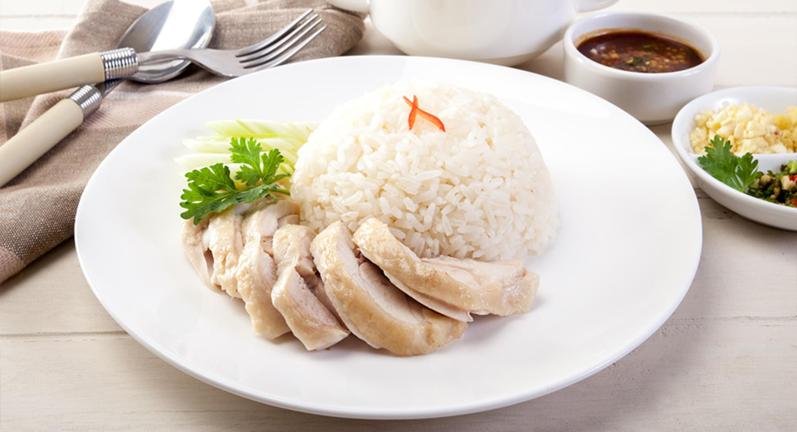

### sample1.jpg



```json
{
   "chicken rice":{
      "accuracy":0.9546242157618204,
      "matches":[
         {
            "name":"chicken rice, rice only",
            "_id":"5ec751c3ec2d19094cf862ae",
            "similarity":1.0
         },
         {
            "name":"chicken rice, with roasted chicken",
            "_id":"5ec751dbec2d19094cf862af",
            "similarity":1.0
         },
         {
            "name":"chicken rice, with skin removed",
            "_id":"5ec751f3ec2d19094cf862b0",
            "similarity":1.0
         },
         {
            "name":"chicken rice, with steamed chicken",
            "_id":"5ec7520bec2d19094cf862b1",
            "similarity":1.0
         },
         {
            "name":"chilli sauce, chicken rice",
            "_id":"5ec753a4ec2d19094cf862c2",
            "similarity":1.0
         }
      ]
   }
}
```

### sample2.jpg


```json
{
   "Burger":{
      "accuracy":0.9809342722098032,
      "matches":[
         {
            "name":"burger, big mac, mcdonalds'",
            "_id":"5ec5553dc6cdad9b7b13efd6",
            "similarity":1.0
         },
         {
            "name":"burger, double whopper with cheese, burger king",
            "_id":"5ec55584c6cdad9b7b13efd7",
            "similarity":1.0
         },
         {
            "name":"bbq turkey bacon double cheeseburger, burger king",
            "_id":"5ec55296c6cdad9b7b13efce",
            "similarity":0.5
         },
         {
            "name":"bk big fish, burger king",
            "_id":"5ec552cbc6cdad9b7b13efcf",
            "similarity":0.5
         },
         {
            "name":"croissan'wich with chicken sausage, burger king",
            "_id":"5ec555cac6cdad9b7b13efd8",
            "similarity":0.5
         }
      ]
   }
}
```

### sample3.jpg (Acai Bowl, Muesli)


```json
{
   "ice kacang":{
      "accuracy":0.9898489,
      "matches":[
         {
            "name":"Ice kacang, durian",
            "_id":"5ec76210d5f0ee6256059fba",
            "similarity":1.0
         }
      ]
   },
   "goreng pisang":{
      "accuracy":0.5903058,
      "matches":[
         {
            "name":"Pisang goreng",
            "_id":"5ec6c87ebfe2612b2604618a",
            "similarity":1.0
         }
      ]
   },
   "cereal prawns":{
      "accuracy":0.11543696,
      "matches":[
         {
            "name":"cereal, puffed rice with cocoa coating",
            "_id":"5ec4fa4ef0ab4835be506dc0",
            "similarity":0.5
         }
      ]
   },
   "muesli":{
      "accuracy":0.07835157,
      "matches":[
         {
            "name":"cereals, ready-to-eat, muesli, dried fruit and nuts",
            "_id":"5ec4fac2f0ab4835be506dc4",
            "similarity":1.0
         }
      ]
   },
   "murtabak":{
      "accuracy":0.06393858,
      "matches":[
         {
            "name":"chicken murtabak",
            "_id":"5ec750ebec2d19094cf862a5",
            "similarity":0.5
         }
      ]
   }
}
```

### sample4.jpg


```json
{
   "mixed grills":{
      "accuracy":0.6920372098684311,
      "matches":[
         {
            "name":"breakfast cereal, mixed, contains whole grains",
            "_id":"5ec4f4b9f0ab4835be506d95",
            "similarity":0.5
         },
         {
            "name":"breakfast cereal, mixed, not whole grains",
            "_id":"5ec4f4d7f0ab4835be506d96",
            "similarity":0.5
         },
         {
            "name":"fruit, mixed, spicy pickled",
            "_id":"5ec608e05957fa1d42111076",
            "similarity":0.5
         },
         {
            "name":"Mushroom, mixed, braised",
            "_id":"5ec74998ec2d19094cf86258",
            "similarity":0.5
         },
         {
            "name":"Vegetables, mixed, braised",
            "_id":"5ec749b1ec2d19094cf86259",
            "similarity":0.5
         }
      ]
   }
}
```

### sample5.jpg


```json
{
   "chicken chop":{
      "accuracy":0.4267810583114624,
      "matches":[
         {
            "name":"chicken chop, grilled",
            "_id":"5ec7503bec2d19094cf8629d",
            "similarity":1.0
         },
         {
            "name":"Chicken chop, DF, W/ skin",
            "_id":"5ec75c23ec2d19094cf8631c",
            "similarity":1.0
         },
         {
            "name":"chicken, breast, kfc, hot and crispy",
            "_id":"5ec55f1a69eef8907d7921aa",
            "similarity":0.5
         },
         {
            "name":"chicken, breast, kfc, original recipe",
            "_id":"5ec55f5c69eef8907d7921ab",
            "similarity":0.5
         },
         {
            "name":"chicken, broilers or fryers, wing, meat only, cooked, fried, kfc (nns)",
            "_id":"5ec55f9869eef8907d7921ac",
            "similarity":0.5
         }
      ]
   }
}
```

### sample6.jpg


```json
{
   "char siew":{
      "accuracy":0.9328579902648926,
      "matches":[
         {
            "name":"pow, char siew, steamed",
            "_id":"5ec50ddef0ab4835be506e60",
            "similarity":1.0
         },
         {
            "name":"sauce, char siew",
            "_id":"5ec6beef379f63889728f892",
            "similarity":1.0
         },
         {
            "name":"char siew",
            "_id":"5ec74e51ec2d19094cf86289",
            "similarity":1.0
         },
         {
            "name":"Rice, Char siew",
            "_id":"5ec74e9bec2d19094cf8628c",
            "similarity":1.0
         },
         {
            "name":"Char siew, vegetarian",
            "_id":"5ec77fded5f0ee625605a0fe",
            "similarity":1.0
         }
      ]
   }
}
```

### sample7.jpg (Pound Cake)


```json
{
   "Peanut Pancake":{
      "accuracy":0.7283916354179383,
      "matches":[
         {
            "name":"cookie, peanut",
            "_id":"5ec4fccaf0ab4835be506dd6",
            "similarity":0.5
         },
         {
            "name":"pancake, home prepared",
            "_id":"5ec509bdf0ab4835be506e42",
            "similarity":0.5
         },
         {
            "name":"Pancake, cheese, Japanese style",
            "_id":"5ec74f45ec2d19094cf86293",
            "similarity":0.5
         },
         {
            "name":"cracker, peanut",
            "_id":"5ec757fdec2d19094cf862f0",
            "similarity":0.5
         },
         {
            "name":"Kok chai,Puff, peanut",
            "_id":"5ec78b972a0e1aaa65d6dedc",
            "similarity":0.5
         }
      ]
   }
}
```

### sample8.jpg (Green Leafy Vegetables)


```json
{
   "Hor Fun":{
      "accuracy":0.57412845,
      "matches":[
         {
            "name":"Hor fun, FR",
            "_id":"5ec76a5bd5f0ee625605a00e",
            "similarity":1.0
         }
      ]
   },
   "green leafy vegetables":{
      "accuracy":0.49068958,
      "matches":[
         {
            "name":"vegetable, dark green leafy, unspecified, boiled, drained",
            "_id":"5ec7d0dff0693dad19f45522",
            "similarity":0.5
         }
      ]
   },
   "Dumpling noodle soup":{
      "accuracy":0.34987733,
      "matches":[
         {
            "name":"Xiao wan mian noodle soup, noodle soup",
            "_id":"5ec7c026a5d09c18c6fd99b3",
            "similarity":0.6666666666666666
         }
      ]
   },
   "pig organ soup":{
      "accuracy":0.318676,
      "matches":[
         {
            "name":"pig organ soup",
            "_id":"5ec78d1e2a0e1aaa65d6deec",
            "similarity":1.0
         }
      ]
   },
   "miso soup":{
      "accuracy":0.20961979,
      "matches":[
         {
            "name":"miso soup",
            "_id":"5ec77f2cd5f0ee625605a0f6",
            "similarity":1.0
         }
      ]
   }
}
```

### sample9.jpg (Waffle)


```json
{
   "cheng tng":{
      "accuracy":0.938348,
      "matches":[
         {
            "name":"cheng tng",
            "_id":"5ec74fa6ec2d19094cf86297",
            "similarity":1.0
         }
      ]
   },
   "ice kacang":{
      "accuracy":0.9301423,
      "matches":[
         {
            "name":"Ice kacang, durian",
            "_id":"5ec76210d5f0ee6256059fba",
            "similarity":1.0
         }
      ]
   },
   "cheese fries":{
      "accuracy":0.74177116,
      "matches":[
         {
            "name":"kfc cheese fries",
            "_id":"5ec56eb269eef8907d7921f2",
            "similarity":0.6666666666666666
         }
      ]
   },
   "steamed buns":{
      "accuracy":0.12782742,
      "matches":[
         {
            "name":"Buns (baked and steamed,plain and with sweet fillings)",
            "_id":"5ec4f650f0ab4835be506da3",
            "similarity":0.5
         }
      ]
   },
   "chin chow drink":{
      "accuracy":0.104789205,
      "matches":[
         {
            "name":"Chin chou; chin chow",
            "_id":"5ec76ce0d5f0ee625605a027",
            "similarity":0.5
         }
      ]
   }
}
```

### sample10.jpg (Bak Kut Teh)


```json
{
   "chicken soup":{
      "accuracy":0.80921793,
      "matches":[
         {
            "name":"Condensed chicken soup",
            "_id":"5ec6bf5b379f63889728f8a9",
            "similarity":0.6666666666666666
         }
      ]
   },
   "pig organ soup":{
      "accuracy":0.38466844,
      "matches":[
         {
            "name":"pig organ soup",
            "_id":"5ec78d1e2a0e1aaa65d6deec",
            "similarity":1.0
         }
      ]
   },
   "bak kut teh":{
      "accuracy":0.25693104,
      "matches":[
         {
            "name":"bak kut teh",
            "_id":"5ec6c6d6bfe2612b2604617c",
            "similarity":1.0
         }
      ]
   },
   "mushroom soup":{
      "accuracy":0.11938426,
      "matches":[
         {
            "name":"dao xiao mian, beef, soup",
            "_id":"5ec4ff63f0ab4835be506deb",
            "similarity":0.5
         }
      ]
   },
   "Miso ramen, with fishcake":{
      "accuracy":0.111823976,
      "matches":[
         {
            "name":"miso ramen",
            "_id":"5ec77f16d5f0ee625605a0f5",
            "similarity":1.0
         }
      ]
   }
}
```

### sample11.jpg


```json
{
   "fried chicken":{
      "accuracy":0.4661085233092308,
      "matches":[
         {
            "name":"fried chicken frankfurter",
            "_id":"5ec76773d5f0ee6256059ff1",
            "similarity":0.6666666666666666
         },
         {
            "name":"Stir fried chicken, with ginger",
            "_id":"5ec7af5ba5d09c18c6fd9903",
            "similarity":0.6666666666666666
         },
         {
            "name":"stir fried chicken, with beansprouts",
            "_id":"5ec7af73a5d09c18c6fd9904",
            "similarity":0.6666666666666666
         },
         {
            "name":"Brown rice vermicelli, fried, plain",
            "_id":"5ec4f52ff0ab4835be506d99",
            "similarity":0.5
         },
         {
            "name":"gluten, fried",
            "_id":"5ec502e4f0ab4835be506e0a",
            "similarity":0.5
         }
      ]
   }
}
```

### sample12.jpg


```json
{
   "Claypot Rice":{
      "accuracy":0.9787323872248331,
      "matches":[
         {
            "name":"claypot rice, with mixed vegetable",
            "_id":"5ec75631ec2d19094cf862dd",
            "similarity":1.0
         },
         {
            "name":"claypot rice, with prawn",
            "_id":"5ec75649ec2d19094cf862de",
            "similarity":1.0
         },
         {
            "name":"claypot rice, with stewed beef",
            "_id":"5ec75661ec2d19094cf862df",
            "similarity":1.0
         },
         {
            "name":"Rice, W/ frog leg, claypot,Claypot rice, with frog leg",
            "_id":"5ec76bc6d5f0ee625605a01c",
            "similarity":1.0
         },
         {
            "name":"flour, rice",
            "_id":"5ec50134f0ab4835be506dfb",
            "similarity":0.5
         }
      ]
   }
}
```

### sample13.jpg (Hyderabadi Biryani)


```json
{
   "Pilaf, pea":{
      "accuracy":0.9951233,
      "matches":[
         {
            "name":"pea pilaf",
            "_id":"5ec78b052a0e1aaa65d6ded6",
            "similarity":0.5
         }
      ]
   },
   "paella seafood":{
      "accuracy":0.25498962,
      "matches":[
         {
            "name":"seafood paella",
            "_id":"5ec79a6f2a0e1aaa65d6df77",
            "similarity":1.0
         }
      ]
   },
   "fried rice":{
      "accuracy":0.090909824,
      "matches":[
         {
            "name":"Fried rice, with egg and spring onion",
            "_id":"5ec76a0ad5f0ee625605a00b",
            "similarity":1.0
         }
      ]
   },
   "Bee hoon, goreng":{
      "accuracy":0.064468645,
      "matches":[
         {
            "name":"Beehoon, goreng, Indian, Indian fried beehoon",
            "_id":"5ec77337d5f0ee625605a06a",
            "similarity":1.0
         }
      ]
   },
   "yam rice":{
      "accuracy":0.049354777,
      "matches":[
         {
            "name":"yam rice",
            "_id":"5ec7c11ba5d09c18c6fd99bd",
            "similarity":1.0
         }
      ]
   }
}
```

### test1.png


```json
{
   "satay":{
      "accuracy":0.9036583205064138,
      "matches":[
         {
            "name":"satay, beef, frozen",
            "_id":"5ec69d76f6a755c9867f6d7d",
            "similarity":1.0
         },
         {
            "name":"satay, chicken, canned",
            "_id":"5ec69d92f6a755c9867f6d7e",
            "similarity":1.0
         },
         {
            "name":"satay, chicken, frozen",
            "_id":"5ec69dadf6a755c9867f6d7f",
            "similarity":1.0
         },
         {
            "name":"satay, mutton, frozen",
            "_id":"5ec69dc9f6a755c9867f6d80",
            "similarity":1.0
         },
         {
            "name":"Satay lembu",
            "_id":"5ec6cb26bfe2612b260461a1",
            "similarity":0.5
         }
      ]
   }
}
```

### test2.png


```json
{
   "hokkien prawn mee":{
      "accuracy":0.7410953640937805,
      "matches":[
         {
            "name":"Hokkien prawn mee, FR, Fried hokkien noodles, with prawn",
            "_id":"5ec770a6d5f0ee625605a04d",
            "similarity":1.0
         },
         {
            "name":"prawn, king, cooked",
            "_id":"5ec5f00c17b23b939f5dbe63",
            "similarity":0.3333333333333333
         },
         {
            "name":"prawn, king, raw",
            "_id":"5ec5f02c17b23b939f5dbe64",
            "similarity":0.3333333333333333
         },
         {
            "name":"prawn, pink, raw",
            "_id":"5ec5f04817b23b939f5dbe65",
            "similarity":0.3333333333333333
         },
         {
            "name":"prawn, salted, dried",
            "_id":"5ec5f06417b23b939f5dbe66",
            "similarity":0.3333333333333333
         }
      ]
   }
}
```

### test3.png


```json
{
   "Tauhu Goreng":{
      "accuracy":0.4233477438489596,
      "matches":[
         {
            "name":"tauhu goreng",
            "_id":"5ec7b77ca5d09c18c6fd9958",
            "similarity":1.0
         },
         {
            "name":"Taugeh goreng tauhu,Beansprouts, with taukwa and chilli, stir fried",
            "_id":"5ec7a4bf2a0e1aaa65d6dfde",
            "similarity":0.6666666666666666
         },
         {
            "name":"Tauhu, with spring onion, stir fried; Soyabean, with spring onion, stir fried",
            "_id":"5ec76b29d5f0ee625605a016",
            "similarity":0.5
         },
         {
            "name":"Beehoon, goreng, Indian, Indian fried beehoon",
            "_id":"5ec77337d5f0ee625605a06a",
            "similarity":0.5
         },
         {
            "name":"Ikan kembong , goreng",
            "_id":"5ec77c46d5f0ee625605a0d4",
            "similarity":0.5
         }
      ]
   }
}
```

### test4.png


```json
  "chicken rice":{
      "accuracy":0.6688736627499262,
      "matches":[
         {
            "name":"chicken rice, rice only",
            "_id":"5ec751c3ec2d19094cf862ae",
            "similarity":1.0
         },
         {
            "name":"chicken rice, with roasted chicken",
            "_id":"5ec751dbec2d19094cf862af",
            "similarity":1.0
         },
         {
            "name":"chicken rice, with skin removed",
            "_id":"5ec751f3ec2d19094cf862b0",
            "similarity":1.0
         },
         {
            "name":"chicken rice, with steamed chicken",
            "_id":"5ec7520bec2d19094cf862b1",
            "similarity":1.0
         },
         {
            "name":"chilli sauce, chicken rice",
            "_id":"5ec753a4ec2d19094cf862c2",
            "similarity":1.0
         }
      ]
   }
}
```

### test5.jpg (Not Food)


```json
{
   "milk":{
      "accuracy":0.98270696,
      "matches":[
         {
            "name":"milk, flavoured, low fat",
            "_id":"5ec626f4c3154c0601ad6006",
            "similarity":1.0
         }
      ]
   },
   "Sweets":{
      "accuracy":0.959975,
      "matches":[
         {
            "name":"SUGARS, SWEETS AND CONFECTIONERY",
            "_id":"5ec7cc30f0693dad19f45401",
            "similarity":0.3333333333333333
         }
      ]
   },
   "Chocolate":{
      "accuracy":0.73347723,
      "matches":[
         {
            "name":"biscuit, chocolate",
            "_id":"5ec4ed42f0ab4835be506d58",
            "similarity":1.0
         }
      ]
   },
   "Alcoholic Beverage":{
      "accuracy":0.2014189,
      "matches":[
         {
            "name":"Alcoholic beverages",
            "_id":"5ec4e780f0ab4835be506cd5",
            "similarity":0.6666666666666666
         }
      ]
   },
   "orange":{
      "accuracy":0.12329376,
      "matches":[
         {
            "name":"juice, orange, commercial",
            "_id":"5ec60b725957fa1d4211108f",
            "similarity":1.0
         }
      ]
   }
}
```

### sushi.png


```json
{
   "sushi":{
      "accuracy":0.8717188119888306,
      "matches":[
         {
            "name":"sushi, california roll",
            "_id":"5ec7b2c3a5d09c18c6fd9927",
            "similarity":1.0
         },
         {
            "name":"sushi, cooked prawn",
            "_id":"5ec7b2dba5d09c18c6fd9928",
            "similarity":1.0
         },
         {
            "name":"sushi, cooked scallop",
            "_id":"5ec7b2f4a5d09c18c6fd9929",
            "similarity":1.0
         },
         {
            "name":"sushi, crabmeat mayonnaise",
            "_id":"5ec7b30ca5d09c18c6fd992a",
            "similarity":1.0
         },
         {
            "name":"sushi, egg mayonnaise",
            "_id":"5ec7b324a5d09c18c6fd992b",
            "similarity":1.0
         }
      ]
   }
}
```

### xiao long bao.jpg


```json
{
   "xiao long bao":{
      "accuracy":0.9940262138843536,
      "matches":[
         {
            "name":"xiao long bao (steamed pork dumpling)",
            "_id":"5ec7c00ea5d09c18c6fd99b2",
            "similarity":0.5
         },
         {
            "name":"sole, long tongue, raw",
            "_id":"5ec5f62b17b23b939f5dbe9b",
            "similarity":0.25
         },
         {
            "name":"Chicken pau, chicken pow, chicken bao, chicken bau, chicken pao, ji baozi , chicken bun, pow",
            "_id":"5ec75133ec2d19094cf862a8",
            "similarity":0.25
         },
         {
            "name":"dao xiao mian, beef, soup",
            "_id":"5ec4ff63f0ab4835be506deb",
            "similarity":0.2
         },
         {
            "name":"Lian rong bao, Shou tao",
            "_id":"5ec50dfaf0ab4835be506e61",
            "similarity":0.2
         }
      ]
   }
}
```

### chicken rice.jpg


```json
{
   "chicken rice":{
      "accuracy":0.9815775354703268,
      "matches":[
         {
            "name":"chicken rice, rice only",
            "_id":"5ec751c3ec2d19094cf862ae",
            "similarity":1.0
         },
         {
            "name":"chicken rice, with roasted chicken",
            "_id":"5ec751dbec2d19094cf862af",
            "similarity":1.0
         },
         {
            "name":"chicken rice, with skin removed",
            "_id":"5ec751f3ec2d19094cf862b0",
            "similarity":1.0
         },
         {
            "name":"chicken rice, with steamed chicken",
            "_id":"5ec7520bec2d19094cf862b1",
            "similarity":1.0
         },
         {
            "name":"chilli sauce, chicken rice",
            "_id":"5ec753a4ec2d19094cf862c2",
            "similarity":1.0
         }
      ]
   }
}
```


